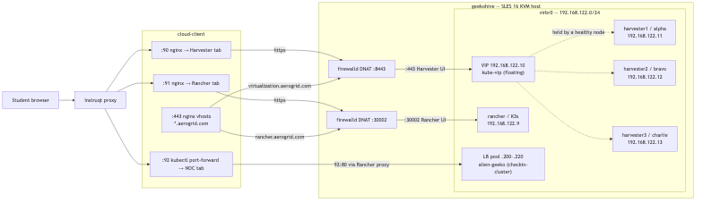

# rodeo-cli — Architecture & design

Technical reference for contributors and maintainers. For deploying a workshop, see [User guide](get-started.md).

**Version:** 0.14.2 <!-- x-release-please-version -->
**License:** GPL-3.0-or-later

---

## What rodeo-cli is

`rodeo-cli` deploys the **infrastructure for a rodeo**: a live, hands-on workshop where attendees work against real systems. It builds a lab of **nested KVM VMs** on a single Linux host, driven by a declarative plan — you pick a profile, it converges the host.

The stack it builds depends on the chosen **engine type** (see [Engine types & profiles](#engine-types-profiles)):

- **`suse-virt`** — a 3-node Harvester HCI cluster (+ optional Rancher Prime)
- **`rancher`** — a single VM running Rancher Prime on K3s
- **`suse-edge`** — Rancher Prime + Elemental + Edge Image Builder + edge nodes

Every profile shares the same foundation: host networking, firewalld DNAT, DNS, storage, and phase orchestration on nested KVM/libvirt. The tool runs on **cloud instances**, **Instruqt builder VMs**, **local VMs**, or **bare metal** — anywhere you have KVM and enough RAM/disk.

---

## Design goals

| Goal | How it is met |
|------|----------------|
| Declarative lab definition | `rodeo-plan.yaml` + secrets + `-P` / `--paramfile` |
| Plan before apply | `rodeo plan` (read-only diff vs host) |
| Safe resume | Per-plan state, `--from PHASE`, `--force` |
| One orchestrator | `DeployRunner` — no duplicated TUI/plain/bash paths |
| Host setup is idempotent | Ansible roles `kvm_host` + `vms` + `pxe_server` |
| Long waits are cancellable | `threading.Event` + process groups in poll loops |
| Instruqt-safe builds | `deployment_target: instruqt` skips `finalise`; hostimage boot uses `start-if-needed` |
| Self-contained install | Ansible roles bundled in `rodeo/data/ansible/` |
| Minimal first-phase friction | `scripts/bootstrap-sles.sh` (curl | bash) + `rodeo bootstrap` subcommand + `install-deps --link` for global binary + `init --example` for pre-seeded declarative labs. See [Get started](get-started.md). |
| Graceful stop/restart + host reset | `rodeo stop`/`start` (infra-aware from definition: infra_type, components, start_order; graceful ACPI + host services; restartable). `clean --all --hard --secrets --force-network` for full reset (VMs/networks/states/passwords; no package removal). Clean runs stop first unless --hard. |
| Interactive definition generation | `rodeo generate` (templates base via parameter collection for hybrid customization, produces full config-dir yaml skeleton with project conventions like infra_type; post-validation via load_config; next steps for bootstrap/deploy/stop/start/clean lifecycle). Enables consistent entry to declarative model (definition as source for inventory/renderer/phases). |


**Vision (roadmap):** Declarative lab deployment — declare desired state, preview diff, converge, destroy what you own. See [ROADMAP.md](https://github.com/avaleror/rodeo-cli/blob/main/ROADMAP.md).

---

## Two-dimension model

rodeo-cli has two independent axes that combine to produce a lab deployment:

```
Tech platform  ×  Host context  =  lab deployment

suse-edge          baremetal        SUSE Edge 3.6 on bare metal KVM
suse-edge          instruqt         SUSE Edge 3.6 on Instruqt KVM
suse-virt          instruqt         SUSE Virtualization on Instruqt KVM
rancher            aws              Rancher on an AWS EC2 KVM host
```

**Tech platform** — what lab topology and software stack to deploy. Encoded in `rodeo/profiles/<name>.py` + `data/platforms/<name>/definition.yaml`. Platform code is host-agnostic; the same profile works on any host context.

**Host context** — where the KVM host runs and what that implies for host-level setup. Encoded in `deployment_target` in `rodeo-plan.yaml`. Affects: guarded phases, firewall/DNAT configuration, external IP detection, success screen output, and **infra adaptation** (`rodeo/host_context.py`): resource floors, disk backend, guest cache/io. Acquire can be provisioned or BYO; both converge through the same overlays. The underlying infrastructure is always KVM/libvirt regardless of host context.

| `deployment_target` | Host type | Key differences |
|---|---|---|
| `baremetal` | Linux bare metal with KVM | full firewalld + DNAT; optional disk-space warn |
| `instruqt` | Instruqt managed KVM builder | `finalise` guarded; vCPU/RAM presets (~70% host) |
| `aws` | Provisioned EC2 *or* BYO on EC2 | `provider:` + destroy; `disk_gb` floor 1200; NVMe → `image_dir` |
| `gcp` *(planned)* | GCP instance with KVM | external IP via GCE metadata; VPC firewall rules |

**Acquire vs adapt.** Host acquire can be provisioned (`rodeo up --target aws` / Fleet `provider:`) or BYO (SSH inventory / operator-created EC2). Both must hit `apply_host_context()` before deploy so workshops do not fork playbooks per cloud. Tech platform declares *what* lab; host context declares *where* and *how the host must be shaped*.

Adding a new host context requires: `config.py` allowed list, `up_cmd.py` auto-detection, `runner.py` vars file, `success.py` output, and an overlay in `host_context.py`. See the Extension points table below.

---

## Engine types & profiles

Two terms that sound alike but are different:

- **Engine `type`** — the deploy *pipeline*: which phases run and how. Code lives in `rodeo/profiles/<name>.py` (a `RodeoProfile` subclass) + `data/platforms/<name>/definition.yaml`. There are **three** today.
- **Profile** (`--profile`) — a named, runnable *lab* (a config-dir, bundled or under `~/.rodeo/profiles/`). Each profile picks one engine type. There are **six** bundled ones.

Since PR #4 the three profile classes are thin: `RodeoProfile` (`profiles/base.py`) owns config assembly (`default_cfg()` — loads the definition with a static fallback) and phase dispatch (a table-driven `run_phase()` with a no-Rancher skip guard). Each subclass carries only its data and deltas — `static_vms`, `resources`, `versions`, and small hooks like `extra_cfg()` / `_default_user()`.

### The three engine types

| Engine type | Phase pipeline | Boot method | Stack |
|-------------|----------------|-------------|-------|
| `suse-virt` | `kvm_host → vms → pxe_server → cluster → rancher → apply → finalise` | iPXE network install (UEFI) | Harvester HCI cluster (+ optional Rancher Prime) |
| `rancher` | `kvm_host → vms → boot → rancher → apply → finalise` | cloud-init image | 1 VM: Rancher Prime on K3s |
| `suse-edge` | `kvm_host → vms → boot → rancher → elemental → apply → finalise` | cloud-init image | Rancher Prime + Elemental Operator + EIB + edge nodes |

The Harvester path is the outlier: it needs `pxe_server` (iPXE/TFTP/HTTP) and a `cluster` phase that network-installs each node and waits for the VIP. The cloud-image profiles skip both — a single `boot` phase starts the network and VMs directly. `suse-edge` adds one phase, `elemental`, which installs the Elemental Operator after Rancher so edge nodes can register over TPM. `rancher`/`elemental` phases are skipped automatically when a topology has no Rancher node.

### Bundled profiles

| Profile | Engine type | Topology |
|---------|-------------|----------|
| `rancher` | `rancher` | 1 VM: Rancher Prime on K3s |
| `test` | `suse-virt` | 2-node Harvester, no Rancher |
| `harvester-ha` | `suse-virt` | 3-node Harvester, no Rancher (etcd HA) |
| `harvester-2n` | `suse-virt` | 2-node Harvester + Rancher Prime |
| `harvester` | `suse-virt` | 3-node Harvester HCI + Rancher Prime |
| `suse-edge` | `suse-edge` | Rancher + Elemental + EIB + 4 edge nodes (SUSE Edge 3.6) |

Per-profile topology tables (VMs, IPs, RAM) live in each [deployment guide](get-started.md). The detailed suse-virt topology and iPXE boot chain are documented below as the reference implementation.

---

## High-level architecture

```
┌─────────────────────────────────────────────────────────────┐
│  CLI (click)                                                │
│  init · plan · deploy · status · clean · ssh · logs · …     │
└──────────────────────────┬──────────────────────────────────┘
                           │ load_config() + validate_config()
                           ▼
┌─────────────────────────────────────────────────────────────┐
│  Profile (e.g. SuseVirtProfile)                             │
│  phases · vm_names · guarded_phases · run_phase()           │
└──────────────────────────┬──────────────────────────────────┘
                           │
                           ▼
┌─────────────────────────────────────────────────────────────┐
│  DeployRunner.run() → Iterator[DeployEvent]                 │
│  PhaseStarted · LogLine · ProgressUpdate · PhaseDone · …    │
└───────┬─────────────────────────────┬───────────────────────┘
        │                             │
        ▼                             ▼
┌───────────────────┐       ┌─────────────────────────────┐
│ Ansible phases    │       │ Python phases (per profile) │
│ kvm_host, vms,    │       │ boot · cluster · rancher ·  │
│ pxe_server        │       │ elemental · apply · finalise│
│ ansible-playbook  │       │ ClusterPhase · RancherPhase │
│ -e @vars-file     │       │ LibvirtDriver               │
└───────────────────┘       └─────────────────────────────┘
        │                             │
        ▼                             ▼
┌─────────────────────────────────────────────────────────────┐
│  KVM host (SLES 16 / Leap / Ubuntu / Fedora)                │
│  libvirt · firewalld · virbr0 · 4 nested VMs                │
└─────────────────────────────────────────────────────────────┘
```

**Consumers of the event stream:**

- `rodeo/app.py` — Textual TUI (DeployPanel + LogsPanel)
- `rodeo/commands/deploy.py` — Rich plain output

Neither contains pipeline logic. Both subscribe to the same `DeployRunner` generator.

---

## Why Ansible and Python (not one or the other)

| Layer | Tool | Rationale |
|-------|------|-----------|
| Host packages, systemd, firewalld, sysctl | **Ansible** | Declarative idempotency; SLES 16 edge cases already encoded in roles |
| VM disks, ISOs, XML, cloud-init, network XML | **Ansible** | Template + file generation; community.libvirt modules |
| iPXE boot server (nginx, dnsmasq, boot files) | **Ansible** | `pxe_server` role; two-stage UEFI → TFTP → HTTP |
| VM start order, VIP poll, kubeconfig, nodes Ready | **Python** | 20–90 minute waits, progress UX, cancellation |
| K3s, Rancher API, cluster import | **Python** | Procedural API sequence; structured errors |
| Runtime VM ops (status, clean, restart) | **libvirt-python** | Direct API; avoids virsh where possible |

Bash deploy scripts (`start-vms.sh`, `setup-rancher.sh`, `deploy.sh`) were **retired in v0.3**. Logic lives in `engine/cluster.py` and `engine/rancher.py`.

**Do not replace Ansible roles with Python** without a live KVM regression. The fragile Instruqt boot-order behavior is in the roles.

---

## Repository layout

```
rodeo/
├── cli.py                 Click entry; ConfigError handler
├── config.py              Plan load, Jinja, -P/--paramfile, secrets, validation
├── state.py               ~/.rodeo/state/<plan-name>.yaml (profiles own phase lists; `reset_from` requires phases arg)
├── ssh.py                 Shared SSH opts + helpers (used by engine + commands)
├── app.py                 Textual TUI (event subscriber only)
├── engine/
│   ├── runner.py          DeployRunner, vars file, phase dispatch helpers
│   ├── cluster.py         ClusterPhase
│   ├── rancher.py         RancherPhase
│   └── libvirt.py         LibvirtDriver
├── profiles/
│   ├── base.py            RodeoProfile — shared config assembly + phase dispatch
│   ├── rancher.py         Rancher Prime on K3s (1 VM)
│   ├── suse_virt.py       Harvester HCI + Rancher (default workshop profile)
│   └── suse_edge.py       SUSE Edge 3.6 (Rancher + Elemental + EIB + edge nodes)
├── commands/              Thin CLI wrappers
├── service/               JSON report helpers (doctor, status) for CLI + fleet
├── fleet/                 Laptop→host workshop fan-out (OpenSSH; see docs/fleet.md)
├── widgets/               TUI panels
└── data/
    ├── platforms/         definition.yaml per tech platform (suse-virt, suse-edge, rancher)
    ├── ansible/           kvm_host + vms + pxe_server roles (bundled)
    ├── examples/          reference rodeo-plan.yaml per platform (not workshop content)
    ├── deployer/          inventory.local + legacy examples
    └── templates/         init templates

tests/                     pytest (config, runner, cluster, ansible contract, fleet, …)
docs/                      architecture.md, get-started.md, fleet.md, …
```

---

## Deployment pipeline

Each engine type runs a subset of the phase catalog below, in the order given by its profile's `phases` list (see [Engine types & profiles](#engine-types-profiles)). State is per plan name (`cfg["name"]`). The dispatch is generic: `RodeoProfile.run_phase()` sends Ansible phases to `stream_ansible` and the rest through a `phase → DeployRunner method` table.

| Phase | Engine | Used by | Summary |
|-------|--------|---------|---------|
| `kvm_host` | Ansible | all | KVM packages, modular libvirt, NM unmanaged conf, firewalld rules (not started), storage pool, sysctl |
| `vms` | Ansible | all | Download ISOs/images, virbr0 + DHCP leases, qcow2 disks, config ISOs, define domains (not start); disk-first boot order |
| `pxe_server` | Ansible | `suse-virt` | nginx on `virbr0:8080`, `ipxe.efi` TFTP, vmlinuz/initrd/rootfs, per-node iPXE scripts + config YAMLs, dnsmasq two-stage boot |
| `boot` | `DeployRunner` | `rancher`, `suse-edge` | Start virbr0 + cloud-image VMs directly (no iPXE); wait for IPs |
| `cluster` | `ClusterPhase` | `suse-virt` | firewalld on; virbr0 up; start h1 → VIP → h2 → 90s → h3 → rancher; kubeconfig; 3 nodes Ready |
| `rancher` | `RancherPhase` | all | K3s, Helm, cert-manager, Rancher Prime, admin API. Skipped if no Rancher node. Harvester import is a lab exercise. |
| `elemental` | `RancherPhase._install_elemental` | `suse-edge` | Install Elemental Operator (CRDs + operator) so edge nodes register over TPM |
| `apply` | `DeployRunner` | all | Apply extra manifests (Fleet GitOps, demo workloads); never cached, re-runs each `up` |
| `finalise` | `DeployRunner` | all | VM autostart + `libvirt-guests` enable |

The `suse-virt` pipeline (the widest) is the reference implementation detailed in the sections below. `rancher` and `suse-edge` swap the `pxe_server`/`cluster` pair for a single `boot` phase on cloud images; `suse-edge` adds `elemental`.

**Timeouts (nested KVM):** VIP ≤ 60 min, kubeconfig ≤ 30 min, nodes Ready ≤ 90 min.

**Instruqt guard:** `finalise` is in `guarded_phases`. Skipped when `deployment_target: instruqt` unless `--finalise`. Do not bake finalise into a hostimage (agent / boot hang); use `rodeo start-if-needed` on track setup. See `docs/examples/instruqt.md`.

---

## Configuration system

### Precedence (lowest → highest)

1. `_BASE_DEFAULTS` in `config.py`
2. Profile `default_cfg()` (e.g. `SuseVirtProfile`)
3. `rodeo-plan.yaml` (Jinja-rendered if templated)
4. `--paramfile` (deep merge, tfvars-style)
5. `-P dotted.path=value` (CLI overrides)

### Jinja plans

```yaml
parameters:
  memory: 16384
resources:
  harvester:
    memory_mib: {{ memory }}
```

`StrictUndefined` — missing parameters fail at load time, not mid-deploy.

### Secrets (`??` placeholders)

Resolved at load time from `~/.rodeo/secrets.yaml`, `??env:`, `??file:`, or `??cmd:`. `validate_config()` fails closed on unresolved or empty credentials. (Note: `rodeo generate` now guards the global secrets file with exists check + warning to avoid silent clobber.)

Passwords go to Ansible via a **mode-600 vars file** (`-e @file`), never on argv. Password-bearing Ansible template tasks use `no_log: true`.

### Ansible vars file (`DeployRunner._write_vars_file`)

Generated per deploy. Keys Ansible actually consumes:

- `libvirt_flavors` (nested — matches `vm.xml.j2`, `images.yml`)
- `lab_dns_domain` (not `dns_domain`)
- `harvester_version`, `harvester_iso_checksum` (version-keyed map)
- network, passwords, `image_dir`, optional `harvester_token`

### State

`~/.rodeo/state/<plan-name>.yaml` — phase completion, timestamps, `last_error`. chmod 600.

- `rodeo deploy` skips completed phases
- `rodeo deploy --from PHASE` clears that phase and later
- `rodeo deploy --force` ignores state

---

## Event model

```python
DeployRunner.run() yields:
  PhaseStarted(phase)
  PhaseSkipped(phase, reason)   # "done" | "before_start" | "instruqt"
  LogLine(line)
  ProgressUpdate(step, elapsed, total, detail)
  PhaseDone(phase, elapsed)
  PhaseFailed(phase, rc, message)
  DeployComplete()
```

**Failure semantics:**

- Exceptions in `profile.run_phase()` → `PhaseFailed`, pipeline stops
- `runner.stop` checked in all poll loops
- `runner.terminate()` SIGTERMs subprocess group (TUI quit → exit 130)
- Subprocess timeouts in RancherPhase → failed rc, not uncaught exceptions

---

## Workshop topology (suse-virt)

| VM | Role | IP | Default RAM |
|----|------|-----|-------------|
| harvester1 | Bootstrap (alpha) | 192.168.122.11 | 20 GiB |
| harvester2 | Join (bravo) | 192.168.122.12 | 20 GiB |
| harvester3 | Join (charlie) | 192.168.122.13 | 20 GiB |
| rancher | Rancher Prime / K3s | 192.168.122.9 | 8 GiB |

- **VIP:** 192.168.122.10 (Harvester API/UI via kube-vip)
- **DNS domain:** `rodeo.lab` (libvirt dnsmasq + `/etc/hosts`)
- **Host DNAT:** :8443 → Harvester VIP :443, :30002 → Rancher NodePort



*Editable source:* [`assets/diagrams/rodeo-network-ports.mmd`](assets/diagrams/rodeo-network-ports.mmd)

The diagram shows the full path from a student browser through Instruqt `cloud-client` nginx tabs, host `firewalld` DNAT on **geekohive**, and `virbr0` guests (VIP, Harvester nodes, Rancher, optional LB pool).

VM IPs/user for Python-side ops (ssh, restart, status, cluster waits) come from profile `default_cfg()` + plan `vms` (profile-driven in TUI panels too). Full `vm_nodes` (MACs/UUIDs/flavors + provisioning) still from `roles/vms/defaults/main.yml` (Ansible side). Custom topologies / single inventory source on the roadmap (Phase C). TUI LogsPanel and phase focus now derive VM list from cfg/profile instead of hardcodes.

### Harvester install via iPXE (not ISO-first boot)

Harvester 1.8.1 requires UEFI; legacy BIOS PXE is not supported. The `pxe_server` role provisions network boot on `virbr0`:

```
UEFI firmware (empty disk, no bootloader)
  → DHCP from dnsmasq on 192.168.122.1
  → Stage 1: boot ipxe.efi (TFTP)                  [dhcp-boot tag:!ipxe]
  → Stage 2: ONE generic boot.ipxe over HTTP       [dhcp-boot tag:ipxe]
  → boot.ipxe chains to the per-node script by MAC: :8080/ipxe/mac-<mac>
  → kernel + initrd + squashfs over HTTP (installer console logged to ttyS1)
  → unattended install (config YAML at :8080/config/config-harvesterN.yaml)
```

The per-node routing is **MAC-based**, not per-host dnsmasq tags: libvirt already
writes a `<host mac=…>` for each node's IP, and a second `dhcp-host` for the same
MAC (to set a routing tag) is silently ignored by dnsmasq — so all iPXE clients
get one `boot.ipxe`, which selects the node script by `${net0/mac:hexhyp}`.

VM XML boot order is **disk first, management NIC second**. On first boot the qcow2 is empty, so UEFI falls through to NIC PXE. After install, reboots go straight to disk. ISO CDROMs remain attached as fallback; `RancherPhase` ejects them once the cluster is up.

**On-disk layout after `pxe_server`:**

| Path | Purpose |
|------|---------|
| `/var/lib/libvirt/dnsmasq/ipxe.efi` | Stage-1 UEFI loader (TFTP) |
| `/srv/harvester-pxe/harvester/` | vmlinuz, initrd, rootfs.squashfs, ISO symlink |
| `/srv/harvester-pxe/ipxe/boot.ipxe` | Generic stage-2 script (chains by MAC) |
| `/srv/harvester-pxe/ipxe/mac-<mac>` | Per-node iPXE scripts (named by mgmt MAC) |
| `/srv/harvester-pxe/config/config-harvester{N}.yaml` | CREATE/JOIN Harvester config (0644 so nginx serves it) |

Ref: [Harvester v1.8 PXE boot install](https://docs.harvesterhci.io/v1.8/install/pxe-boot-install).

---

## SLES 16 / Instruqt constraints (do not break)

Documented in role comments and [CONTEXT.md](https://github.com/avaleror/rodeo-cli/blob/main/CONTEXT.md).

1. **NetworkManager only** — wicked removed; virbr0/vnet* marked unmanaged
2. **Modular libvirt** — disable monolithic `libvirtd`; enable socket-activated daemons
3. **libvirt-guests off during build** — stalls `network-online.target` on Instruqt save/reboot
4. **virbr0 autostart false until cluster** — same boot-order issue
5. **firewalld rules permanent, daemon stopped during Ansible** — protects Instruqt mgmt NIC
6. **90s gap between harvester2 and harvester3** — etcd join race prevention
7. **OVMF 4MB non-SecureBoot** — 2MB images gone on SLES 16
8. **xorriso** — not genisoimage

**Files to treat as fragile:**

- `roles/kvm_host/tasks/libvirt.yml`
- `roles/vms/tasks/network_setup.yml`
- `roles/vms/defaults/main.yml` (MACs ↔ DHCP ↔ Harvester config)
- `roles/pxe_server/templates/network-pxe.xml.j2` (two-stage iPXE dnsmasq routing)
- `roles/pxe_server/templates/ipxe-node.j2` (UEFI `initrd=` kernel arg required)
- `engine/cluster.py` (`ETCD_JOIN_GAP`, virbr0 start before VM boot)

---

## Security model (lab scope)

Single-tenant training lab, not production.

| Choice | Reason |
|--------|--------|
| TLS verify off | Self-signed Harvester/Rancher certs |
| SSH `StrictHostKeyChecking=no` | Ephemeral lab VMs, host key baked in cloud-init |
| `security_driver = "none"` | Nested KVM on SELinux-enforcing SLES 16 |
| SELinux permissive (kvm_host role) | Nested virt lab compatibility |
| One host ed25519 key in all guests | Deployer drives SSH/API setup |
| DNAT on host | Attendees reach UIs via host IP |

Protected: secrets in chmod-600 files, `no_log` on password tasks, random passwords/tokens from `rodeo init`, fail-closed validation.

---

## Testing & CI

```bash
ruff check rodeo tests
pytest tests/ -v
```

| Test area | Purpose |
|-----------|---------|
| `test_config.py` | Merge, Jinja, -P, secret resolvers, validation |
| `test_runner.py` | Pipeline events, instruqt guard, vars file |
| `test_ansible_consistency.py` | Profile ↔ Ansible defaults ↔ plan template drift |
| `test_ansible_vars_contract.py` | Vars file keys match Ansible consumers |
| `test_pxe_integration.py` | Playbook order, pxe_server role, boot order, JOIN VIP guard |
| `test_cluster.py` / `test_rancher.py` | Poll loops, timeouts, parsing |
| `test_plan_cmd.py` | Plan diff command |

GitHub Actions: `.github/workflows/ci.yml` — Python 3.10 + 3.12 (ruff, pytest); ansible-lint job on 3.12.

Live KVM regression is still manual (or geekohive) before touching MAC/DHCP/ISO chain.

---

## Extension points

| Add… | Where |
|------|-------|
| New tech platform | New `RodeoProfile` in `profiles/` + `definition.yaml` in `data/platforms/` + register in `profiles/__init__.py` |
| New deployment_target | `config.py` allowed list + `up_cmd.py` auto-detect + `runner.py` vars + `success.py` output + `host_context.py` overlay + `kvm_host` role conditionals |
| New phase | Add to `profile.phases` + `run_phase()` dispatch |
| New CLI command | `commands/*.py` + register in `cli.py` |
| Host OS support | `install_deps.py` + possibly kvm_host role conditionals |
| New workshop/demo | Separate repo: `rodeo-plan.yaml` (type + deployment_target) + lab guide + host setup docs |
| Multi-host workshop fan-out | `rodeo/fleet/` + `workshop.yaml` — see [Fleet](fleet.md); do not multi-host the phase engine |

---

## Fleet (multi-host workshops)

For N identical student/instructor KVM hosts, the laptop runs `rodeo fleet` over
OpenSSH. Each remote still executes single-host `rodeo up` / `doctor` / `status`.
**Shipped F0–F2.1:** JSON reports → fan-out → deploy/retry/access/diagnose.  
**Roadmap:** F4a AWS + Phase E single-host `rodeo up --target aws` MVP;
next **GCP** → **Vultr Bare Metal** → Hetzner Cloud.
Equinix is out of scope. See [Fleet](fleet.md#roadmap).

---

## Related documents

| Document | Audience |
|----------|----------|
| [User guide](get-started.md) | Workshop operators deploying labs |
| [Fleet](fleet.md) | Multi-host workshops (F0–F2.1 + F4a AWS MVP; [roadmap](fleet.md#roadmap) F3, F4b–d) |
| [ROADMAP.md](https://github.com/avaleror/rodeo-cli/blob/main/ROADMAP.md) | Planned declarative-deployment features |
| [CONTEXT.md](https://github.com/avaleror/rodeo-cli/blob/main/CONTEXT.md) | Full project context for AI/developers |
